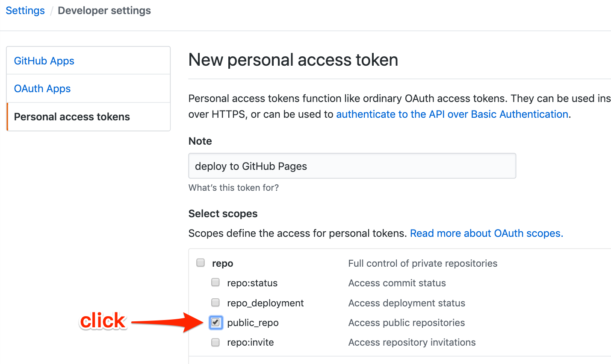

# Vue.js Demo

Deploy Vue.js app to GitHub Pages using drone in five minutes.

[](https://cloud.drone.io/go-training/vue-gh-pages-demo)

See the [demo site](https://go-training.github.io/vue-gh-pages-demo/).

## Project setup

```sh
yarn install
```

### Compiles and hot-reloads for development

```sh
yarn serve
```

### Compiles and minifies for production

```sh
yarn build
```

### Lints and fixes files

```sh
yarn lint
```

### Customize configuration

See [Configuration Reference](https://cli.vuejs.org/config/).

## Create your access token



## Deploy using Drone

```yml
---
kind: pipeline
name: testing

platform:
  os: linux
  arch: amd64

steps:
- name: release
  image: node:13
  commands:
  - yarn install
  - yarn build

- name: publish
  image: plugins/gh-pages
  settings:
    username:
      from_secret: username
    password:
      from_secret: password
    pages_directory: dist
```
